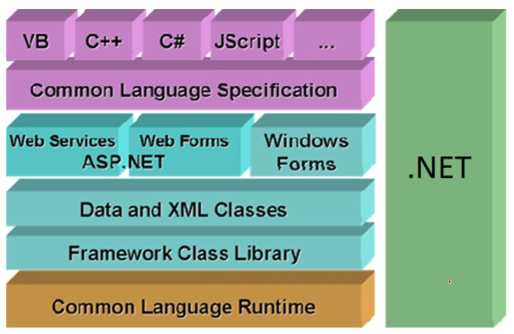
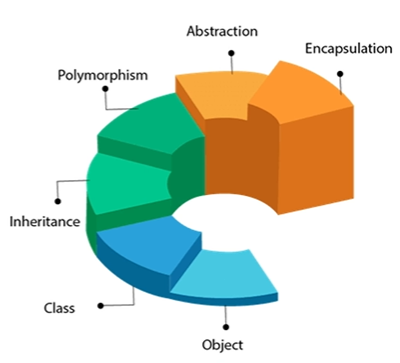
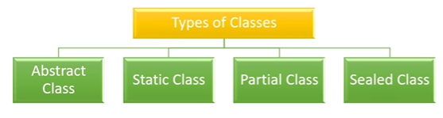
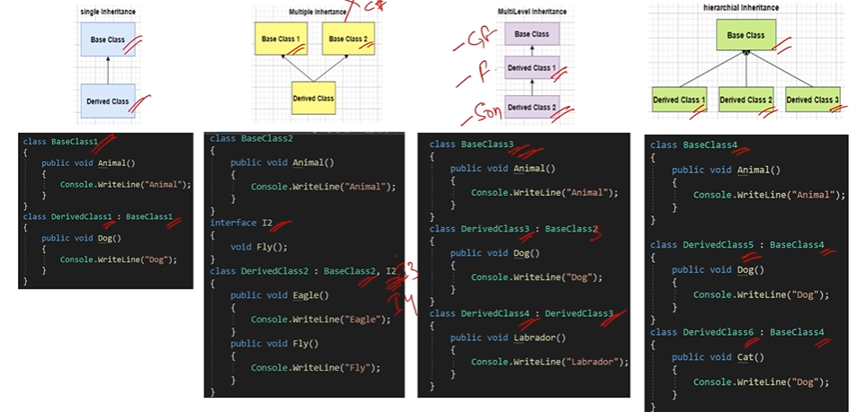

### ❓1. What is the C#? What is the difference between C# and .NET ?

**Answer:**

- C# is a modern, object oriented programming language which is developed by microsoft. It is primarily used for developing aplications on .NET platform --- such as Web Applications, Desktop Applications, APIs, Mobile Applications using .NET MAUI or Xamarin.
- .NET Framework, on the other hand is the complete development platform which consists of CLR(Common Language Runtime), Class Libraries and tools required to build and run applications which are written in C#, F# and other .NET Supported languages

<!-- <p align="center"></p> -->


---

### ❓2. What are the main concepts of OOPS ?

**Answer:**

- Object oriented programming is a programming paradim which is based on the concept of objects, which contain data(properties, fields) and methods(functions).
- OOPS principles helps us to build the scalable, reusable, modular and maintainable code.
- The four pillars of OOP in C#:

  - **Inheritance** - Enables a class to reuse the code of another class.
  - **Polymorphism** - Allows methods to behave differently based on the object.
  - **Abstraction** - Shows only essential features and hides the complexity.
  - **Encapsulation** - Binds every programming component into a single unit called as Class, hides internal details and protect data.

  <p align="center"></p>

---

### ❓3. What are the limitations of OOPs ?

**Answer:**

- OOPs is not suitable for small scale and immediate applications as building application with OOPs requires proper planning and requirement gathering which takes time and resources.

---

### ❓4. What are Classes and Objects ?

**Answer:**

- Classes are the **logical unit or blueprint**. It contains fields, properties, methods.

  - Class members are:
    1. A constructor is a method in the class which gets executed whenever a object of the class is created.
    2. A field is a variable of any type which stores the data.
    3. A property is a member that provides flexible mechanism to read and write the private field.
    4. A method is a code block which contains series of statements.

- Objects are the instance of the Class.

---

### ❓5. What are the types of the class ?

**Answer:**

- The different types of classes are :
  - Abstract Class
  - Static Class
  - Partial Class
  - Sealed Class

<p align="center"></p>

---

### ❓6. Is it possible to prevent object creation of a class in C# ?

**Answer:**

- **Abstract Class, Static Class, Private Class** for these class types object creation is not possible.

---

### ❓7. What are the difference between Property and Functions ?

**Answer:**

- Property is a specialized function but can only get and set the field values.

---

### ❓8. What are the differenct types of inheritance ?

**Answer:**

<p align="center"></p>

---

### ❓9. How to prevent class from being inherited ?

**Answer:**

- By using **SEALED** keyword in class
- By using **STATIC** keyword in class

```csharp

public sealed class Employee1
{

}

public static class Employee2
{

}

public class PermanentEmployee : Employee1 ❌❌❌
{

}

public class PermanentEmployee : Employee2 ❌❌❌
{

}
```

---

### ❓10. What is the difference between Abstraction and Encapsulation ?

**Answer:**

**Abstraction**

- Abstraction means showing only essential things and hide the complexity or Implentations
- Abstraction is the Concept of hiding programming components

```csharp
public abstract class EmployeeSalary
{
  public inte CalculateSalary()
  {
    return 10*300000;
  }
}

public class Employee : EmployeeSalary
{

}

public class SalarySection
{
  Employee employee =  new Employee();
  int sal = employee.CalculateSalary();
}

```

**Encapsulation**

- Wrapping of data and methods into a single unit is called Encapsulation.\
- Encapsulation is the implementation of the hiding of data.

```csharp
public class Employee
{
  private int empExperience;
  public int EmpExperience
  {
    get{return empExperience;}
    set{empExperience = value;}
  }
}
```

---

### ❓11. What is Polymorphism ?

**Answer:**

- Polymorphism is the ability of variable, method or object to behave differently based on the context.
  1. Compile-time polymorphism ( Method overloading, operator overloading )
  2. Run-time polymorphism ( Method overriding )

```csharp
public class ComplexNumber
{
  public int X;
  public int Y;

  public ComplexNumber(int x, int y)
  {
    X = x;
    Y = y;
  }

  public static ComplexNumber operator +(ComplexNumber a, ComplexNumber b)
  {
    return new ComplexNumber(a.X+b.X, a.Y+b.Y);
  }

  public override String toString()
  {
    return $"{X} + i{Y}";
  }
}


ComplexNumber num1 = new ComplexNumber(1,2);
ComplexNumber num2 = new ComplexNumber(3,4);

ComplexNumber num3 = num1 + num2;
```

---

### ❓❓❓12. If two methods are same except return type, then methods are overloaded or what will happen ?

**Answer:**

- No, this will show compile time error.

```csharp
public class Employee
{
  public int GetSalary(int designation)   ❌❌❌
  {
    return 100000;
  }
  public string GetSalary(int designation)  ❌❌❌
  {
    return "100000";
  }
}
```

---

### ❓ 13. What is the difference between Method Overriding and Method Hiding ?

**Answer:**

- With method hiding we can completely hide the implementation of the methods of the base class from the derived class using **new** keyword

| Feature              | Method Hiding                    | Method Overriding            |
| -------------------- | -------------------------------- | ---------------------------- |
| Keyword              | `new`                            | `override`                   |
| Base method required | No `virtual` needed              | Must be `virtual`/`abstract` |
| Decided at           | Compile-time (by reference type) | Runtime (by object type)     |
| Polymorphism         | ❌ Not supported                 | ✅ Supported                 |

```csharp
public class BaseClass
{
  public void Greetings()
  {
    Console.WriteLine("BaseClass Hello! ");
  }
}

public class ChildClass
{
  public new void Greetings()
  {
    Console.WriteLine("ChildClass Hello! ");
  }
}


BaseClass obj = new ChildClass();
obj.Greetings();

//OUTPUT :-  BaseClass Hello!
// result is based on the Reference Type but not of Object Type
```

---

### ❓ 14. What are the difference between an Abstract class and an Interface ?

**Answer:**

| Feature              | Abstract Class                                            | Interface                                          |
| -------------------- | --------------------------------------------------------- | -------------------------------------------------- |
| Method Definitions   | Can have both **method declarations** and **definitions** | Only **method declarations**                       |
| Keyword Used         | `abstract`                                                | `interface`                                        |
| Multiple Inheritance | ❌ Not supported                                          | ✅ Supported                                       |
| Constructors         | Can have constructors                                     | Cannot have constructors                           |
| Access Modifiers     | Can have access modifiers on methods                      | All methods are implicitly `public` and `abstract` |
| Fields/Variables     | Can contain fields/variables                              | Cannot contain instance fields                     |

---

### ❓15. What is Interface ? What are the benifits of using interface ?

**Answer:**

- Interface is a contract which defines the methods,properties of a class.
- Interface instructs the class **what to do** but not **how to do**
- Loose coupling is possible with interfaces which benefits in development and unit testing.
- Interfaces used for Dependency Injections.

---

### ❓16. Can Abstract Class be Sealed or Static in C# ?

**Answer:**

- No, Abstract class purpose is to act as the BaseClass for which ever the class inherits it.

---

### ❓17. What are the different ways of method overriding ?

**Answer:**

1. Conventional Method Overriding
2. Abstract Method Overriding
3. Interface Method Overriding
4. virtual override chain
5. Sealed Method Overriding
6. Generic Method Overriding

**Note** : The methods only with **virtual, abstract, override** in base class can be overridden.

---

### ❓18. What are access specifiers ?

**Answer:**
Access Modifiers are the keywords which are used to specify the accessability of the class, method, property and field.

public, private, protected, internal, protected internal.

---

### ❓19. What is the default access modifier in a class ?

**Answer:**

1. For a top-level class, internal is the default access modifier
2. For inner class, private is the default access modifier

---

### ❓20. What is boxing and unboxing ?

**Answer:**

1. Boxing is the process of converting from value type to reference type.
2. Unboxing is the process of converting reference type to value type.
