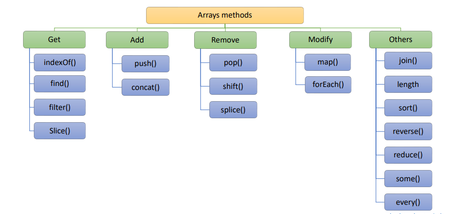

### ❓1. What is javascript ? What is the role of JavaScript Engine ?

**Answer:**

- Javascript is a progamming language that is used to convert static web pages to interactive and dynamic web pages.
- Javascript Engine is a program resides in the browser which used to run the js code

---

### ❓2. What are the variables ? What is the difference between var, let and const ?

**Answer:**

- Variable is used to store data
  | var | let | const |
  | ---------------------------------------------------- | ----------------------------------------- | ------------------------------------------ |
  | var declares variable in `function scope` | let declares a variable in `block scope` | const declares a variable in `block scope` |
  | can be re-declared and re-assigned | cannot be re-declared in the scope but can be re-assigned | cannot be re-declared and re-assigned |
  |hoisted and intialised as undefined|hoisted but not intialised `temporal dead zone`|hoisted but not intialised `temporal dead zone`|

---

### ❓3. What is DOM ?

**Answer:**

- Document Object Modal (DOM) represents web page into a `tree-like structure` that allows javascript dynamically access and manipulate the content and structure of web page.

---

### ❓4. What are data types in JS ?

**Answer**

- Data type determines the type of variable

- There are 2 types of datatypes :
- 1. primitive (immutable, stores value)
- 2. non-primitive (mutable, stores reference)

```
JavaScript Data Types
├── 1. Primitive Types (Immutable, Stored by Value)
│   ├── String      →  "Hello", 'abc'
│   ├── Number      →  42, 3.14, NaN
│   ├── BigInt      →  12345678901234567890n
│   ├── Boolean     →  true, false
│   ├── Undefined   →  let a;     // a is undefined
│   ├── Null        →  let a = null;
│   └── Symbol      →  Symbol("id")
│
└── 2. Non-Primitive Types (Mutable, Stored by Reference)
    └── Object
        ├── Plain Object   →  { name: "Alice" }
        ├── Array          →  [1, 2, 3]
        ├── Function       →  function() { }
        ├── Date           →  new Date()
        ├── RegExp         →  /abc/
        ├── Map            →  new Map()
        └── Set            →  new Set()

```

---

### ❓5. What is a loop ? What are differenct types of loops ?

**Answer**

- A loop is a programming way of executing a piece of code repeatedly until a certain condition met
- The different types of loops are
- 1. for
- 2. while
- 3. do-while
- 4. for...in
- 5. for...of

1. for..in is used to iterate through enumerable property names of an object

```javascript
const obj = { name: "himavanth", age: 25 };

for (let key in obj) {
  console.log(obj[key]);
}

const arr = [a, b, c, d];
for (let val in arr) {
  console.log(val); //      0, 1, 2, 3 ---> index
  consol.log(arr[val]); //  a, b, c, d ---> values
}
```

2. for...of is used to iterate over the values of the iterable object

```javascript
const str = "surya";
for (let char of str) {
  console.log(char); // s, u, r, y, a
}

const arr = [a, b, c, d];
for (let val of arr) {
  console.log(val); //a, b, c, d
}
```

---

### ❓6. What are the Functions ? What are the types of function?

**Answer**

- A function is a reusable block of code which is used to perform an action.
- The types of functions are:

  - Named Function
  - Anonymous Function
  - Arrow Function
  - Function Expression
  - IIFE (Immediatly Invoked Function Expression)
  - Callback Function
  - Higher Order Function

**Note :** Only Named function is hoisted

---

### ❓7. What are Arrow Functions in JS ?

**Answer**

- Arrow function are the simplest and shorter way of defining a function.
- It doesn't have its own binding of **this, super**

---

### ❓8. What are array methods ?

**Answer**



```
JavaScript Array Methods
├── Mutating (Change Original Array)
│   ├── Adding Elements
│   │   ├── push(element1, ...elementN)
│   │   │   → Returns: new length of array
│   │   │
│   │   └── unshift(element1, ...elementN)
│   │       → Returns: new length of array
│   │
│   ├── Removing Elements
│   │   ├── pop()
│   │   │   → Returns: removed element (or undefined)
│   │   │
│   │   ├── shift()
│   │   │   → Returns: removed element (or undefined)
│   │   │
│   │   └── splice(start, deleteCount, item1, ...itemN)
│   │       → Returns: array of removed elements
│   │
│   └── Modifying Elements
│       ├── fill(value, start?, end?)
│       │   → Returns: modified array
│       │
│       ├── reverse()
│       │   → Returns: reversed array (same reference)
│       │
│       └── sort(compareFunction?)
│           → Returns: sorted array (same reference)
│
├── Non-Mutating (Return New Array/Value)
│   ├── Copying
│   │   ├── slice(start?, end?)
│   │   │   → Returns: new array (shallow copy)
│   │   │
│   │   └── concat(value1, ...valueN)
│   │       → Returns: new merged array
│   │
│   └── Converting
│       ├── join(separator?)
│       │   → Returns: string
│       │
│       └── toString()
│           → Returns: string
│
├── Iteration & Testing
│   ├── Iterate
│   │   └── forEach(callback(element, index?, array?), thisArg?)
│   │       → Returns: undefined
│   │
│   └── Test
│       ├── every(callback(element, index?, array?), thisArg?)
│       │   → Returns: boolean
│       │
│       └── some(callback(element, index?, array?), thisArg?)
│           → Returns: boolean
│
├── Searching & Finding
│   ├── Index-based
│   │   ├── indexOf(searchElement, fromIndex?)
│   │   │   → Returns: index number or -1
│   │   │
│   │   ├── lastIndexOf(searchElement, fromIndex?)
│   │   │   → Returns: index number or -1
│   │   │
│   │   └── includes(searchElement, fromIndex?)
│   │       → Returns: boolean
│   │
│   └── Condition-based
│       ├── find(callback(element, index?, array?), thisArg?)
│       │   → Returns: element or undefined
│       │
│       ├── findIndex(callback(element, index?, array?), thisArg?)
│       │   → Returns: index number or -1
│       │
│       ├── findLast(callback(element, index?, array?), thisArg?)
│       │   → Returns: element or undefined
│       │
│       └── findLastIndex(callback(element, index?, array?), thisArg?)
│           → Returns: index number or -1
│
├── Transforming
│   ├── Transform
│   │   ├── map(callback(element, index?, array?), thisArg?)
│   │   │   → Returns: new array
│   │   │
│   │   ├── filter(callback(element, index?, array?), thisArg?)
│   │   │   → Returns: new array
│   │   │
│   │   └── flatMap(callback(element, index?, array?), thisArg?)
│   │       → Returns: new flattened array
│   │
│   └── Flatten
│       └── flat(depth?)
│           → Returns: new flattened array
│
├── Reducing
│   └── Aggregate
│       ├── reduce(callback(accumulator, currentValue, index?, array?), initialValue?)
│       │   → Returns: single value (any type)
│       │
│       └── reduceRight(callback(accumulator, currentValue, index?, array?), initialValue?)
│           → Returns: single value (any type)
│
└── Static Methods
    └── Creation & Testing
        ├── Array.from(arrayLike, mapFn?, thisArg?)
        │   → Returns: new Array
        │
        ├── Array.of(element0, element1?, ...elementN?)
        │   → Returns: new Array
        │
        └── Array.isArray(value)
            → Returns: boolean
```

---

### ❓9. What are Objects ?

**Answer**

- Objects are data types which store data in key value pairs.

---

### ❓10.What is Scope ?

**Answer**

- Scope is logical frame where variables are defined and where variables are accessed.
- 1. Global Scope
- 2. Function Scope
- 3. Block Scope

---

### ❓11. What is Hoisting ?

**Answer**

- Hoisiting is a javascript behaviour where function declarations and variable declarations are moved to top of the respective scope during compilatio phase.

- Only named `functions`, `variables declared with var keyword` are hoisted.
- `let, const variables` are hoisted but remains in `temporal dead zone` until they are intialised

---

### ❓12. What is type coercion ?

**Answer**

- The automatic conversion of value from one datatype to another datatype while performing certain operations.

```javascript
`String and Number concatenation`;
let str = "24";
let num = 1;
let sum = str + num; // RESULT :- "241"

`Comparision operators`;
let num1 = "10";
let num2 = 10;
let res = num1 == num2; //RESULT :- true, because of typecoercion
```

---

### ❓13. What is the difference between == and === ?

**Answer**

- `Loose Equality(==)` compares two variables after performing `type coercion`.
- `Strict Equality(===)` compares two variables without performing `type coercion`

---

### ❓14. What is the difference between Spread Operator and Rest Operator ?

**Answer**

- Spread Operator is used to spread elements in iterabel objects (like arrays, objects, string).
- Rest operator is used in function arguments to collect remaining arguments in an array.

---

### ❓15. What is loop ?

**Answer**

- A loop is programming way of executing a piece of code multiple times until certain condition is met
- Types of loops:
  - for loop
  - while loop
  - do-while loop
  - for...in
  - for...of

---

### ❓16. What is event handling ? What is the use of event handling in JS ?

**Answer**

- Event handling is the process of executing the code in response to the `user interaction` or `browser actions` on the web page.
- addEventListener method is used to attach events to the elements with callback function to perfrom a certain task.

---

### ❓17. What are First-Class Functions ?

**Answer**

- The functions which are treated as a variable or object are called first-class functions.
  - Functions used in function expression.
  - Function passed as argument.
  - Function returned as result.

---

### ❓18. What are pure and impure functions ?

**Answer**

| pure function                                                    | impure function                                                 |
| ---------------------------------------------------------------- | --------------------------------------------------------------- |
| A pure function will always produce `same output for same input` | An impure function produce different outputs for the same input |
| A pure function cannot modify state                              | An impure function can modify state                             |
| A pure function cannot have side effects                         | An impure functions can have side effects                       |

```js
// pure function example START

function add(a, b) {
  return a + b;
}

console.log(add(2, 3)); //OUTPUT : 5
console.log(add(2, 3)); //OUTPUT : 5

// pure function example END

// impure function example START

let total = 0;

function addTotal(value) {
  total += value;
  return total;
}

console.log(addTotal(5)); //OUTPUT : 5
console.log(addTotal(5)); //OUTPUT : 10  --Not Same Output

// impure function example END
```

---

### ❓19. What is Function Currying in JS ?

**Answer**

- The process of converting a function with multiple arguments into nested series of functions with single arguments.

```js
function multiply(a, b) {
  return a * b;
}

function multiplyOrder(a) {
  return function (b) {
    return a * b;
  };
}

const double = multiplyOrder(2);
console.log(double(5)); //   2 * 5 = 10

const triple = multiplyOrder(3);
console.log(triple(5)); // 3 * 5 = 15
```

---

### ❓20. What are call, apply and bind ?

**Answer**

- They are function methods which are used to manipulate this explicitly and invoke the function with specific objects.

```js
function sayHello(message) {
  return `${message}, ${this.name}`;
}

const obj = { name: "Surya" };

//Using call() method we can directly invoke function with specific context and arguments
sayHello.call(obj, "Hello"); // func.call(object,arg1,agr2,...);

//Using apply we can immediatly invoke the function wiht specific context and arguments in an array
sayHello.apply(obj, ["Ravi"]); // func.apply(object,[arg1,arg2,arg3,...])

// Using bind will return a function with the specific context which we will mention.
const greet = sayHello.bind(obj, "Hari");
greet();
```

---

### ❓21. What is string interpolation ?

**Answer**

- String Interpolation is the process of inserting `variables or expressions` inside a string.

---

### ❓22. In how many ways we can concatenate strings ?

**Answer**

- `+ operator`
- concate `const str = str1.concate(str2);`
- template literals ` ${str1} ${str2}`
- join ` strsArray.join(" ");`

---

### ❓23. What is Error Propogation ?

**Answer**

- The process of passing error from one part of code to another using `throw` statement with try catch.

```js
function UserData() {
  try {
    UserAge(24);
    UserAge("");
  } catch (error) {
    consol.error(error.message);
  }
}
function UserAge(age) {
  if (typeof age !== "number") {
    throw new Error("This is not a Number");
  }
}
```

---

### ❓24. What are the different ways of iterating over properties of object ?

**Answer**

- for...in
- Object.keys(obj).foreach((key)=>{})
- Object.values(obj).foreach((value)=>{})

---

### ❓25. How to check if property exists or not ?

**Answer**

```js
const person = {
  name:"Himavanth";
}

console.log("name" in obj);

console.log(person.hasOwnProperty("name"));

console.log(person.name !== undefined);
```

---

### ❓26. How do you clone or copy an object ?

**Answer**

1. using spread operator **(shallow copy)**

   ```js
   const person = { name: "surya" };

   const personCopy = { ...person };
   ```

2. using `Object.assign` **(shallow copy)**

   ```js
   const personCopy = Object.assign({}, person);
   ```

3. using `JSON.parse() & JSON.stringify()` **(deep copy)**

   ```js
   const personCopy = JSON.parse(JOSN.stringify(person));
   ```

---

### ❓27. What is shallow copy and deep copy ?

**Answer**

- In shallow copy if we modify cloned object parent object also modifies
- In deep copy both cloned object and parent object have different references.

---

### ❓28. What is set ?

**Answer**

- set is a collection of unique values
- set have `add, delete, has, size` methods

  ```js
  const arr = [1, 1, 2, 2, 2, 2, 3];
  const objSet = new Set(arr);

  const uniqueArray = [...objSet];
  console.log(uniqueArray); // OUTPUT : [1,2,3]
  ```

---

### ❓29.What is map ?

**Answer**

- Map object is a collection of key-value pairs wher key can be of any type.
- Map maintains order of key-value pairs in which they were inserted.
- Map have `set,get,has,delete,size` methods.

  ```js
  const mapObj = new Map();
  mapObj.set("name", "Surya");
  mapObj.get("name");
  ```

---

### ❓30. What is the difference between Map and Object?

**Answer**

| Map                                                                      | Object                                                             |
| ------------------------------------------------------------------------ | ------------------------------------------------------------------ |
| Map can have any type of keys                                            | Object is restricted to only string and symbols as key             |
| Insertion order is maintained                                            | There is no insetion order                                         |
| Useful when keys are of different types and insertion order is important | Useful when keys are strings or symbols and have simple properties |

---

### ❓31. What is event delegation ?

**Answer**

- Event delegation is javascript technique where event handler is added to parent element to handle events of child elements.

---

### ❓32. What is event bubbling ?

**Answer**

- Event bubbling is a process of javascript when a event is triggerd on a child element it propogates to top of DOM tree, triggering events on every parent elements.

---

### ❓33. What is event capturing ?

**Answer**

- Event Capturing is process in javascript where a event is handled from top of DOM tree(root element) till the target element.

---

### ❓34.

**Answer**
